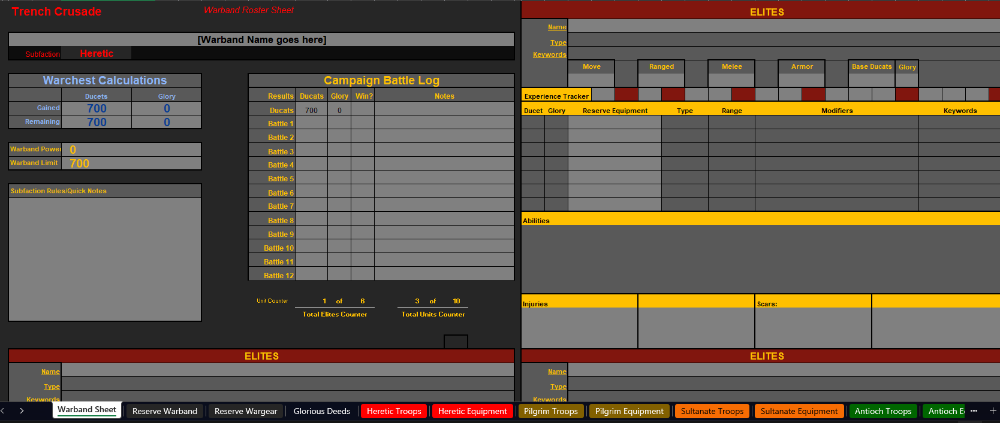

# Trench Crusade Army Builder

In this repo is an excel sheet that helps you build a warband/army for Trench Crusade. I built it for myself, and am sharing it with the community.

## What is Trench Crusade

"[Trench Crusade](https://www.trenchcrusade.com) is a tabletop wargame set in an alternate World War I where the forces of Heaven and Hell battle in the trenches"

"Trench Crusade is a skirmish-scale tabletop miniatures game that will plunge players deep into a horrifying alternate timeline. During the Crusades a heretical band of Templars dared defy the Almighty and, casting aside their sacred vows, unleashed the forces of Hell upon the Earth. Over 800 years later, in the Year of Our Lord 1914, this brutal, merciless war between the forces of Heaven and Hell rages on. This is not just a fight for survival, but a cataclysmic struggle that will decide the very fate of humanity's soul."

## How to use this file

1) On the first tab `Warband Sheet`, choose your **Faction**
2) Then enter the amount of initial Ducets you will be using to start your warband in the **Campaign Battle Log**
3) Go to the second tab `Reserve Warband` and choose the models you want to use. There is information on the Faction tabs that you can look at for quick reference.
4) Go to the third tab `Reserve Wargear` and choose the gear you want your warband to use.
5) Now that you have bought your warband, return to `Warband Sheet` and in the **Elite** and **Troop** sections select your models and gear.

Everything should populate at that point and you should be able to basically use `Warband Sheet` as your warband reference sheet during the game.

In regard to the excel doc, at some point I will probably protect the cells you are not supposed to mess with. In the short term, light grey means you are to interact with it, either a drop down or a text input. Dark grey will be populated by data as you select options.

I want to explicitly thank **EliwoodTachi** for sharing his original work with me. None of this would be possible if the community wasn't awesome!

